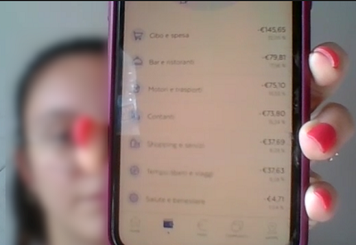
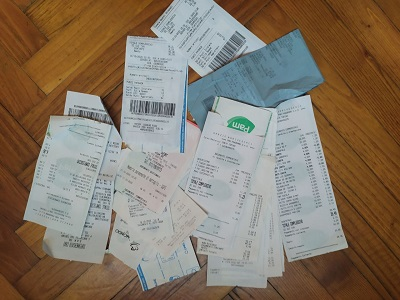
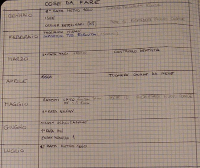

# Milestone 1: Project description and Needfinding: Wallet Manager

## Overview and planning
We want to see how people manage their finances by looking at how they keep records of their expenses and how they plan future ones.

We decided to observe the target population by dividing it according to the efficiency and the experience in the way they manage, organize, and plan their expenses. 

Three categories of people have been delineated:

1. **Beginner users**: they organize expenses in a rough and superficial way because of their low involvement and inexperience. They have rare and sporadic planning of expenses.

2. **Intermediate users**: they try to organize and plan expenses in a complete way but, due to their lack of experience, they make mistakes that lead them to don’t always have optimal planning.

3. **Expert users**: they organize and divide expenses accurately and meticulously through the use of appropriate tools such as tables and spreadsheets. They are used to keeping under control the financial situation by planning the largest expenses.

We have chosen to observe these three types of users in order to have a complete overview of the management and planning of finances. The purpose of the observation is to understand the motivations and needs of the three user groups and identify the differences between them in terms of requirements. 

 

We have decided to observe 5 people:

*Beginner*
- 23 years old, female, Erasmus student, personal expensive
- 20 years old, male, student and worker during weekends, personal expensive

*Intermediate*
- 25 years old, male, part-time worker, personal expensive

*Expert*
- 45 years old, female, worker with family, personal and family expensive
- 55 years old, male, worker with family, personal and family expensive

 

## Observation

We observe that beginner users (2 people) use automatic and already configured solutions such as home banking applications (e.g. PostePay or Intesa Sanpaolo). These applications offer, also, categories subdivisions and create daily and monthly views automatically of user expenses (see Figure 1). With such applications, users can see an overall of the expenses divided into category and they can understand if they have spent too much money on a particular category. They use this information to figure out if they need to limit their expenses for the next period.

Figure 1: Section of the application used by the user that tracks and categorizes expenses automatically.

 

We also observed one intermediate user. He uses a home banking application to keep records of his expenses like the beginners. He, also, has the habit of keeping receipts, for example in his wallet, to keep track of expenses for a certain period. These will be consulted later to draw conclusions. Most of the time, however, we have observed difficulties in reading and understanding the material collected due to the large number of receipts accumulated (see Figure 2).

Figure 2: Set of receipts kept by the user showing the problems of the operation

 

In the end, we observed two experienced users. They have the same methodologies for planning and managing expenses but they use different tools: one relies completely on paper while the other uses digital applications such as excel and spreadsheets reporting receipts and electronic invoices. 

This material is divided into categories and account and then summarized in an annual or monthly chart, in order to have a clear view of past expenses to better plan future ones. Furthermore, they create a view with all the names of the main expenses they will have to carry out (see Figure 3). Finally, we have noticed that both experienced users observed use information from online banking sites to support their planning. 

Figure 3: Annual organization of expenses incurred divided by month

 

## Interviews

**- Tell me if and how you manage your expenses**

- Do you check your expenses regularly or only at specific times?
- Do you keep an eye on all expenses or just some particular category?
- Are there any expenses (e.g. coffee, etc.) that you exclude and that you don't need to keep under control?

 

*Beginners*:
 
Beginner users have difficulties managing expenses regularly and the activity of report and planning them is often a struggle. Because of that they abandoned manual solutions and use automated ones like home banking applications (e.g. PostePay, Intesa Sanpaolo) because they give the users the division of expenses into categories. This leads to reducing cash payments in favor of credit card ones to have a better track of expenses. 

In some situations, they don’t need complex solutions because they can understand the overall situation by checking the total amount of expenses until that moment. For example, they know that the weekly supermarket expense is about the same amount and they can understand if they are spending too much.

Their planning period comes right after the monthly income because they prefer to afford first planned expenses that cannot be postponed because of their inaccurate and unstable planning. In this way, they try to avoid running out of money during the month and risk not being able to pay them. In addition, they don’t have a huge rainy-day-fund.

They pay more attention to some kind of expenses like eating out and transportation while other categories like health and personal care are the least considered. 

 

*Intermediate*:

The intermediate users have a similar approach to beginners. In addition to that, they can manage and plan expenses more easily and regularly. They focus their attention on a few categories that want to keep under control and they plan a fixed budget to not overcome. 

They also use online banking applications to keep the situation under control and they try with such information to make constant planning. They do not always manage to follow the set plan. 

Lastly, they try to put aside a certain amount of income for a rainy-day-fund. In this way, they can manage unexpected events.

 

*Experts*: 

Expert users are able to track main expenses using online banking applications and reporting them on paper or excel spreadsheets dividing them into categories (e.g. taxes, car expenses, house expenses). 

Since both experts interviewed have family and children in charge, they also monitor their main expenses (e.g. medical expenses, school fees, etc.). Because of that, they have to monitor personal, familiar and children’s accounts, and often they create separate savings plans to get better pictures of the economic situation.

They regularly check their expenses and they plan mainly over long periods (monthly or annually) also based on expenses with known deadlines like taxes. 
Furthermore, they don’t keep frequent expenses (supermarket, pizza, coffee, etc.) under control because they are cheaper compared to others. They estimate a monthly budget for this type of expense and they know more or less if they’re respecting it.

The real value of their planning is based on how they manage well-known expenses in different periods planning ahead of schedule and a relevant goal is to have a rainy-day-fund for difficult periods and unexpected expenses.

 

**- Is there a particular reason why you started managing and planning your expenses?**

All users have started managing and planning their expenses when they began to take care of personal incomes or familiar budgets. We noticed that our expert users are more interested in saving money also because they have more responsibilities. For example, when they went to live alone like for studying abroad or when they had a family to take care of.

 

**- Are you satisfied with your expense planning? Would you like to change something in what you do?**

- What, if any, are the difficulties you encounter during the procedure?
- Have you ever thought about doing more in-depth management of your expenses?
- If so, what prompted you to implement a more in-depth management?

 

*Beginners* and *Intermediate*:

Beginners and intermediate users are in most cases satisfied with their *modus operandi*, but they would like better tools that allow more efficient and easier management of expenses so that they can save money with minimal effort. However, they are not prepared to use more complex and time-consuming solutions. 

Users have reported two critical issues in their planning:

Home banking apps roughly categorize expenses and do not allow them to change the categories. For this reason, the offered view is not always correct and they have to remember the badly categorized expenses in order to get meaningful information from the charts. 

Also, their systems are unable to handle unexpected expenses, which can cause troubles and a much more complex and inefficient re-planning.

 

*Expert*:

Expert users are very satisfied with their expenses management, but they wish for additional, more sophisticated tools that allow them to have more control over their expenses even at higher levels of detail. 

With the tools they use, it is too difficult to extract information and adopt better savings strategies by looking at individual expenses (they are too many). For this reason, they only focus on merged and more abstract views. Sometimes to make some general considerations they divide the expenses according to the current credit account used.

One of the interviewed, also, found it too difficult to collect and unify all expenses due to the occurrence of electronic ones. The only solution he found was to print the electronic receipts in order to manage everything but it is too time expensive and it wastes a lot of paper.

Finally, they underlined the worry of forgetting to include some expenses with deadlines in their future planning as they have difficulty in finding such information being spread over several sources (such as documents or websites).

 

**- Have you ever tried other solutions that were not suitable for your purposes?**

- Which ones do you use and which ones you no longer use?

 

*Beginners* and *Intermediate*:

Beginners and intermediate users tried to use spreadsheets or simple applications to enter expenses manually and these proved to be too complex and time-consuming, leading the users to abandon them. Also, most of the time they forget to mark some of the expenses they have made, thus having an incomplete and unsatisfactory view, so the process becomes useless.

 

*Expert*:

Expert users tried to use the spreadsheet by entering all the expenses incurred, but soon abandoned this level of detail because updating the report was too expensive and complex for the time they intended to dedicate.

 

**- What conclusions do you usually draw after seeing your expenses? Can you tell if you have planned well or not?**

 

*Beginners*:

Beginner users are able to deduce elementary conclusions about their monthly expenses. These are mainly based on comparing the expenses of a period with the average of the previous ones and in this way they can understand if they are in line with their habits or if they spent too much money. So they do not make a real plan, but they try to resolve the problems of a lack of organization by spending less in the following period.

 

*Intermediate* and *Expert*:

They can understand much easier than a beginner user if the planning that has been done previously is correct and if there are problems they can quickly modify in order to solve the situation. One user says that he can understand when he is investing his time well in managing expenses and that he likes to do it because he is investing his money well and not wasting it. 

 

**- Is there anything we haven't asked you?**

A user expressed the need for a pre-established template to help him during the period's planning, to avoid making erroneous expenses.

 

The following question was asked only for expert users:

**- Before it became a habit, did you find it difficult to remember to check or record your expenses?**

Expert users said they had problems at the beginning. From year to year, however, with the habit and experience these have diminished and as a result, their management has improved. They also had difficulty understanding how to divide the expenses, and understanding under which items to file them.
They still try to improve because they still have problems to solve such as the difficulty in dividing certain expenses such as taxes.

 

## User Needs
- Need to add expenses in a simple and immediate way by dividing them into custom categories.

- Separate management of family and personal expenses with the possibility to manage multiple accounts and adopt specific planning policies.

- Define plans for future periods taking into account future expenses and help users to understand how much money is left to spend.

- Have savings strategies that help users to set up a rainy-day-fund in order to afford eventual unpredictable expenses or situations like period with lower income.

- Possibility to enter periodic expenses (such as rent, bills, insurance, etc.) in order to avoid multiple entries and to remember the deadlines of some expenses during the pianification phase.

 

## Project Description
First of all, the project wants to help users to add expenses in a simple and immediate way both manually (entering them individually) and automatically (importing information from external sources such as bank accounts). In this way, users will be encouraged to add the few expenses done in cash, while they will be able, if they need to, to re-categorize those already inserted automatically.

Moreover, the users will be able to make future planning for a specific period of time through a custom view of the expenses of that period and with the possibility to set up a budget for some individual categories.

The target devices assumed for the use of the application are *smartphones* and *tablets* so that the user can add, control and plan his expenses at any time of the day and in any place.
