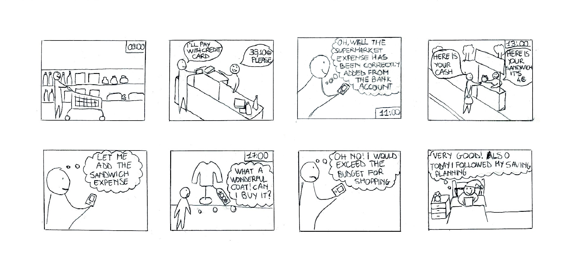
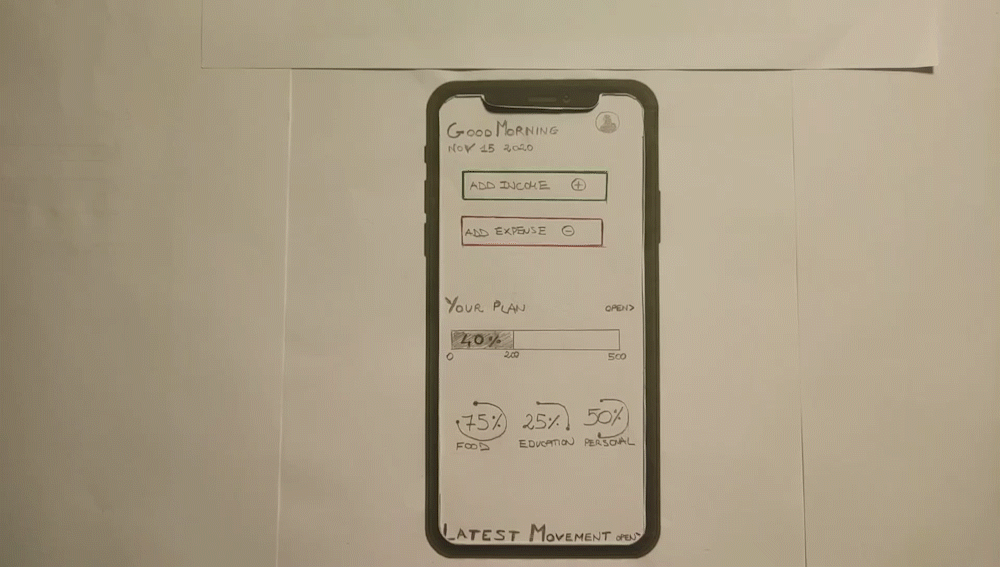
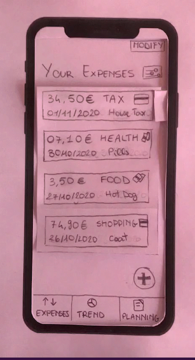
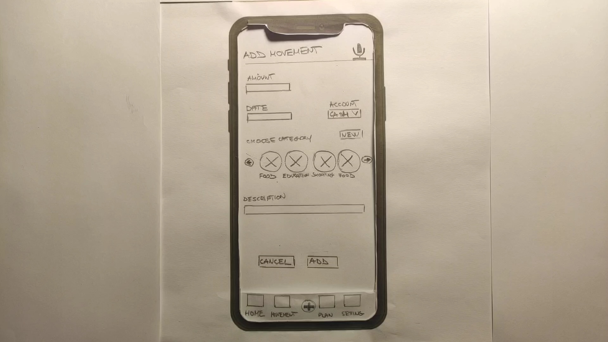
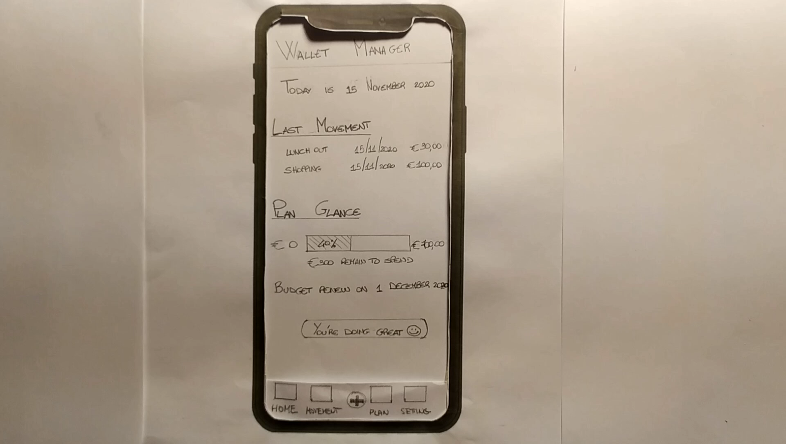
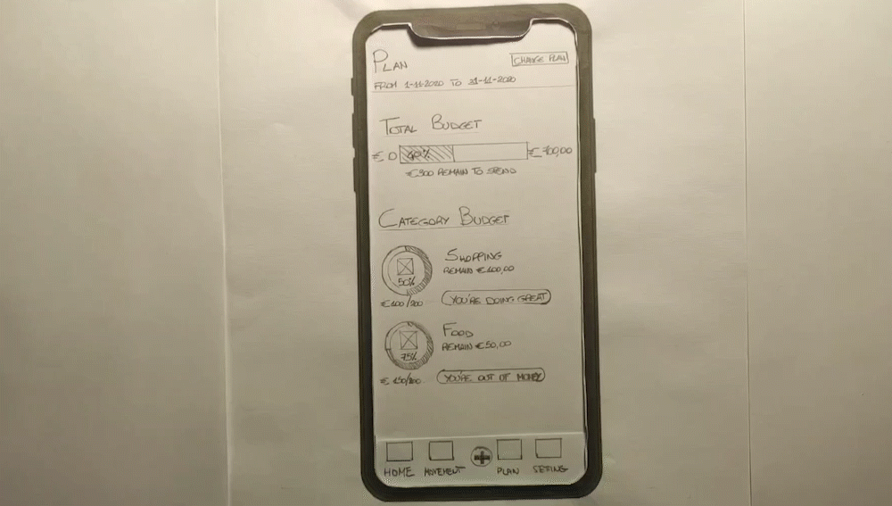

# Milestone 2: Low-Fi Prototyping - Wallet Manager

## Storyboards

 

The chosen storyboard is shown in Figure 1.

The storyboard describes the use of the application during a typical day and it highlights some situations in which the app can be useful for the user. We decided not to show a single scenario due to the different ways in which the user can accomplish his needs.

We can see from the storyboard that the user doesn't need to add the credit card expense because it is added automatically. In the third frame he checks that the expense has been automatically added so he could also check if it is correctly categorized and if he wants, he could modify the record. The cash expenses, instead, can be added manually by the user in an easy way.

Before making a purchase, the user can see the amount of money left to spend thanks to the application. With such information, he can make a better decision regarding the purchase (e.g. he understands that he cannot afford the 100 euro dress expense because he will exceed the budget he set previously).

Finally, in the last frame, he is able to see the progress of his planning and easily understand if he is respecting the goal or not.

The weakness of the storyboard is that we don't show the situation in which the user creates the saving plan by setting the budget for a certain period and several categories.
We decided not to draw it on the storyboard for two reasons. First, it is not immediate to represent the situation without displaying the application interface and secondly, it is not a feature that is performed with the same frequency as those shown in the storyboard.

 

Figure 1: Storyboard

 

## Paper Prototypes

 

We have decided to show in the paper prototypes the main tasks that the user will face during daily use based on what we drew in the storyboard and on the two user needs chosen during the need-finding phase.

We decided to represent four main tasks with the paper prototype:

1. **The user checks and monitors all the expenses filtering them by period and category**. 

    This task is showed in the storyboard when the user is at the supermarket and checks if the expense is added correctly.

2. **The user can add an expense manually**. 

    This task is showed in the storyboard when the user adds manually the sandwich expense.

3. **The user looks at the saving plan and he understands whether or not he is respecting the plan he made**. 

    This task is showed in the storyboard when the user checks if he can buy the coat and at the end of the storyboard if he is following the saving plan correctly.

4. **The user can add and/or modify the saving plan.**

    This task is not present in the storyboard but it is present in the user needs (see *Project Description* paragraph of M1) so we decided to realize it in the prototypes.

 

### **First paper prototype**

The first prototype has a "Main Page" with a summary of all information that the application provides: the latest expenses and the progress with the user's saving plan. 

If the user wants to increase the level of details, he can click on the "Your plan" title to see statistics and more information about his saving plan. He can also click on the "Latest movement" title to read all the expenses in-depth and filter them by category.

 1. **The user checks and monitors all the expenses filtering them by period and category**

    The first page that the user sees is the "Main Page". Scrolling down, he can immediately see the "Latest Movement" added in the application.

    If the user wants to see more details, he can click on the button "open" near the "Latest movement" title. It will open a new page called "Your Movement" with all the expenses that the user has done (Figure 2).

    
    Figure 2: Workflow to see expenses in detail.
 
     

    Inside the "Your Movement" page, the user will be able to see all the expenses divided by period and category. He can see an abstract representation with the pie chart and understand which are the categories with the most money spent (Figure 3). 
    
    Also, below he can see in detail all the expenses represented in the graph with the description, category, date, and amount. 

    
    Figure 3: "Your movement" page.

     
    
    By clicking on the "Month" button at the top right of the screen, he can change the period for displaying expenses, such as daily or annually, instead of the default monthly view. He can also select a specific period by entering the initial and final dates (Figure 4).

    
    Figure 4: Workflow to change the period for the visualization.

     

    The user could click on a category label in the pie chart for filtering by category. The application will highlight this category in the pie chart and will show only the expenses of that category on the list. So the user could better focus on those expenses and make category considerations more easily (Figura 5).
    
    
    Figure 5: Workflow to filter by a particular category (e.g. he sees only the shopping expenses).

     

2. **The user can add an expense manually**
    
    Starting from the "Main Page", the user can manually add an expense by clicking on the "Add Expense" button at the top of the page (Figure 6).

    
    Figure 6: Add Expense button on the "Main Page".

     

    Inside the "Add Expense" page, it will be possible to choose the payment method (cash or credit card) and choose a category from the list. The application will display to the user only the most used categories with the possibility to expand the list with the "Show all" button.

    He can change the date on which the expense was made by clicking the calendar icon. He can set the amount of the expense and at the end, he can write a brief description if he wants to add other details.

    
    Figure 7: Workflow to add an expense.

 

3. **The user looks at the saving plan and he understands whether or not he is respecting the plan he made.**

    Starting from the "Main Page" and clicking on the "Open" button next to the "Your plan" title, the user can look at his saving plan in detail (Figure 8).

    He can check how much total budget is left to spend in order to not exceed the expending limit he set before and understand with a practical label such as "Good Job" if he is respecting the plan he made. 

    He can also decide to keep some individual categories under control by setting a budget for each of them. Then he will see specific statistics for them.
    
    For example, he could decide to spend 200 euros on the food category, and the application will display the remaining budget for that category and it will highlight if he is spending too much.
    
    
    Figure 8: Workflow to see the savings plans.

   

4. **The user can add and/or modify the saving plan**

    The user can change the saving plan by clicking on the "Edit Plan" button located at the top right of the screen (Figure 9). 
    
    Inside the "Edit Plan" page, he can change the period for the plan (weekly, two-weekly, monthly, or annually), set the total budget for that period, and add or modify the individual category budget.

    
    Figure 9: Workflow to edit a savings plan.

 

#### Prototype analysis

- Pros:

    - The use of the "Main Page" with a summary of all information available inside the application.

    - The use of the pie chart to have a complete view of the expenses divided by category and period.

    - The use of graphs and labels on the "Your Plan" page allows the user to understand his situation at a glance.

- Cons:

    - It is not always easy to move through the different sections of the application due to the lack of a navbar.

    - Adding a new expense through the buttons in the "Main Page" is not immediate, because the user can add expenses only in the "Main Page".

    - In the "Main Page" there is too much content and it could be not immediate to use it. 

 
 

### **Second paper prototype**

The second prototype has three main sections accessible through the bottom navigation bar (also through gestures by scrolling between pages). The tabs are "Expenses" where the user can manage and see the list of all expenses, "Trend" where he can check if is respecting the saving plan, and "Planning" where he can add or modify his saving plan.

 

1. **The user checks and monitors all the expenses filtering them by period and category**

    In the "Expenses" section the user can see his expenses with relevant information and filter them by date and category using the button near "Your Expenses" (Figure 10).

    

    Figure 10: Expenses list.

 

2. **The user can add an expense manually**

    In the same section, using the "+" button, the user can add a new expense by entering information like the amount, the category, the date, and a brief description. Once saved, the expense will appear with the others (Figure 11).

    

    Figure 11: Adding an expense.

     

    By clicking on the "Modify" button, the list of expenses becomes editable. Now the user can click on the single expense to modify it or he can select several expenses using the side buttons and delete them if necessary.

    

    Figure 12: Modifying the expenses list.

 

3. **The user looks at the saving plan and he understands whether or not he is respecting the plans made**

    In the "Trend" section he will find a pie chart showing the percentage of expenses divided into categories. 
    
    The user sees the total spent compared to the planned one.

    Scrolling down the page or clicking the arrow button, the user can get the details of the planning for each category showing how much is planned and how much it has been spent. 

    

    Figure 13: Trend.

 

4. **The user can add and/or modify the saving plan**

    The last section "Planning" allows the user to create or modify the planning. The user first decides what type of planning to do (weekly, monthly, annual) and once selected he can define the total budget.

    Scrolling down the page, or clicking the arrow button, he can also plan each category. He can add a new one by clicking the "+" button and setting the budget to assign for a chosen category.

    

    Figure 14: Planning.

 

#### **Prototype analysis**

- Pro:
    - Easy and immediate navigation through sections thanks to the bottom navbar

    - The main sections show first general information or settings and only if the user wants to have more detail he can go to more detailed sections

- Cons: 
    - Adding an expense is not allowed in every section and might not respect the "immediate" characteristic of the user need.

    - The view of expenses is too simple because the application shows only the list.

    - There are two different sections for "Trend" and "Planning" although they are connected and should be in the same section.

    - The choice of detailed sections is unclear. It's difficult to understand if it is the same page or a new one because the bottom bar is always shown and the user can't understand which is the main page of the section.

 
 

### **Prototypes differences** 

The most relevant difference between the first prototype and the second one is the way the user does the planning. 

In the first prototype, the user can choose a specific period delimited by two dates. Even if the user selects the option 'month' for example, without select a specific period, the application implicitly selects the start and the end date as the first and the last day of the current month. 

Once the period and the budget for that period have been set, the user will be able to see the progress of the saving plan only concerning that period. So, for example, if he selects 'month' as the period he will not be able to see the statistics of the monthly plan also projected in a week view. He can see the progress of the plan only in the period chosen at the beginning.

In the second prototype, instead, the user selects a time-slot period (weekly, monthly, or yearly) starting from the day in which the plan is created or modified. So, in this case, the user selects the period exclusively to define the budget. 

This method was chosen to be able to make a quick estimate of the progress of the saving plan over a different period. The application considers the period only like a unit and the user can project the saving plan during different periods by modifying the view in "Trend".

For example, if the user selects that wants to spend 500 euro a month, he can see also the progress of the plan by week. The weekly budget he sees on the page will be the monthly budget split by the number of weeks in the month. In this way, the user can follow the monthly plan also by looking at the plan week by week.

For this reason, the second prototype divides into two different pages the "trend" and "plan" while in the first prototype they are only a single page ("plan" and "edit plan") as they are strictly correlated.

The other differences between prototypes are the way of adding an expense and also the different navigation between pages. In the first prototype, the goal of adding an expense is satisfied by clicking the "ADD EXPENSE" button on the "Homepage" while in the second prototype you need to click the "+" button inside the "Expenses" section. 

 

## Selection Rationale

The two paper prototypes proposed different flows and ways of navigation. 

We decided to create a new paper prototype that would combine the strengths and fix the problems highlighted in the previous ones (see *Prototype analysis* of the first and second prototype).

We took the bottom navigation bar of the second prototype because it allows easy navigation between the main sections of the app. We also decided to insert the button to add expenses in the navbar. In this way, the user will have this option reachable in every section of the app in order to save time and make the task of adding expenses more immediate.

By clicking the mic icon on the top-right of the page the user can add expenses quickly thanks to the microphone (e.g., "Add expense 50 euro with category food"). Then he can review the fields and save the expense.

Figure 15: Add expense page with the new navbar.

 

We decided to have a Homepage like in the first prototype but keeping only the summary of every section in order to make it easy to understand. 
It also gives another way for reaching the most important sections of the app.

Figure 16: Homepage.

 

We also took the view of the expenses from the first prototype because the pie chart allows the user to have a complete and generic view of the expenses without going to see them in detail. Then the user can see the list of expenses for a certain category by clicking on it in the chart or using the filter button.

Figure 17: You Movement.

 

Finally, we decided to keep the saving plan section from the first prototype but simplifying the planning creation or modification using the design from the second paper prototype. 

Figure 18: Saving Plan.

 

Clicking on the configuration button on the top right, the app shows a new page where the user can decide to set a total budget for a certain period and if he wants he can set budget for categories. In this way, the user can choose a different level of detail due to his preferences. For example, a non-expert user will use probably only the total budget and the feedback provided by the application while an expert one will use also in-depth analysis to set up budget for the most important categories.

Figure 19: Plan configuration.
