# Milestone 3: Wireframe and Heuristic Evaluation - Wallet Manager

## Wireframe

At the end of Milestone 2, we created a final paper prototype (*Selection Rationale* paragraph of M2) that combines the strengths of the first and second one. Because of that, the medium-fidelity wireframe has a similar design.

Thanks to this wireframe, we had the possibility to better define the positions of the elements inside the page highlighting the most important ones such as titles and labels. We focused on respecting Nielsen's 10 Usability Heuristics like the visibility of the system status providing feedback to the user.

We choose Marvel to design our wireframe because it allows creating realistic wireframes providing design elements from the main mobile OSs.

 

### **Homepage**

Based on the consideration made with the first two prototypes and based on the third paper prototype made at the end of M2, we choose to display on the Homepage the last 4 expenses made by the user and the amount of the budget left to spend in order to respect his saving plan (Figure 1). In this way, the user can have with a glance the main information available inside the app.

Clicking on the "Show All" buttons next to the section titles, the user can have more details about his expenses and his saving plan. He can also access this information through the bottom bar with the "Expenses" and "Plan" tabs.

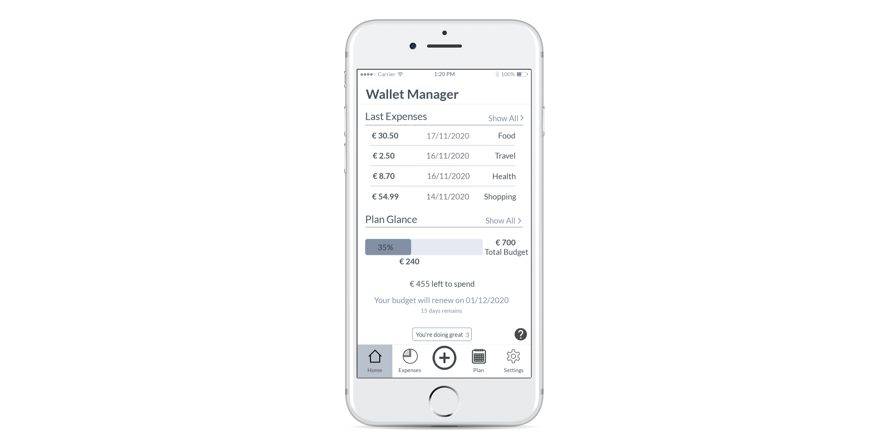

Figure 1: Homepage.

 

### **Expenses**

The "Your Expenses" page gives the user a view of all the expenses made in a certain period divided into categories. He can change the visualization period into "Weekly", "Monthly" and "Yearly" through the selector on the top right of the page. After selecting the period he could see the previous and next one by clicking the back '<'  or next '>' buttons.

The user can filter also the expenses by category and price by clicking on the filter icon (Figure 2). The page also offers a quick filtering function over a single category selecting a label on the pie chart.

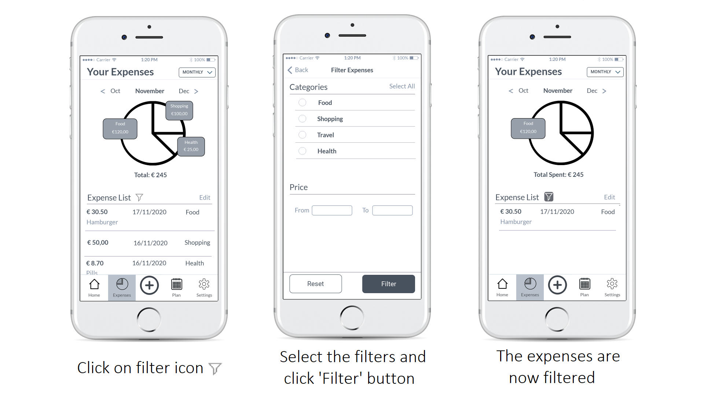

Figure 2: User flow to filter expenses.

Clicking on the "Edit" button near the "Expense List", the user can delete or modify a single item by clicking on the relative icons. After the user edits or removes an expense he will see feedback if the action is completed successfully (Figure 3).

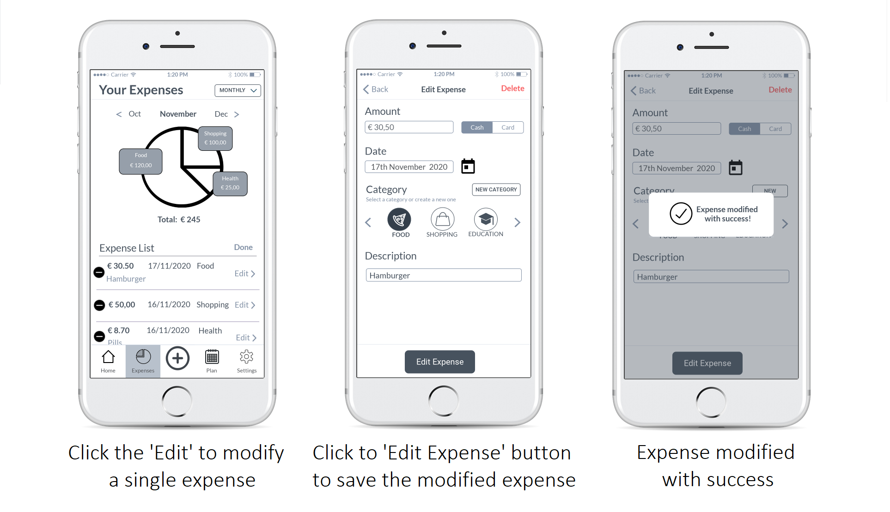

Figure 3: User flow to edit an expense.

 

### **Add an expense**

Clicking on the "+" button on the navbar, the user will reach the "Add Expense" page where he can insert manually all the information about a new expense (Figure 4). 

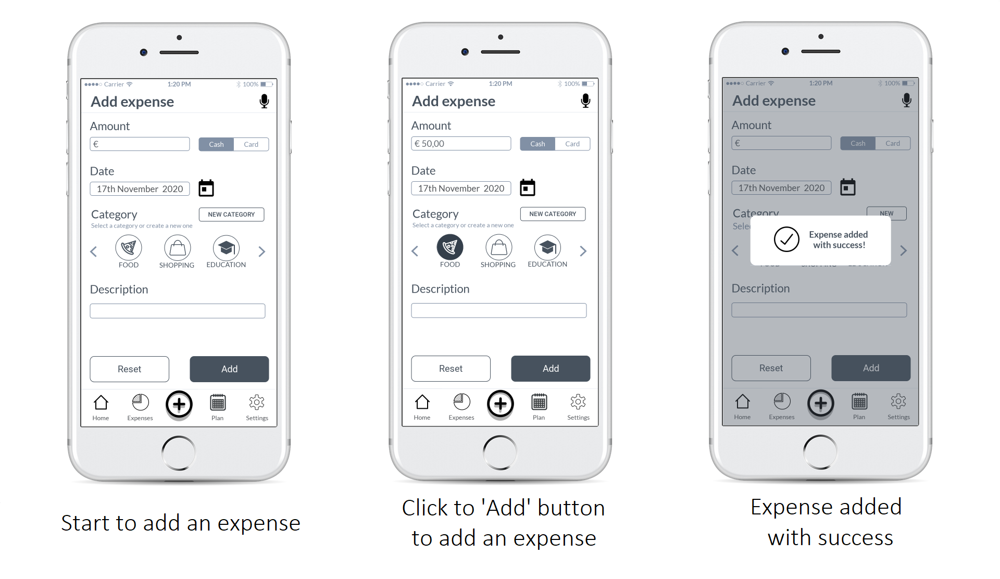

Figure 4: User flow to add an expense manually.

Otherwise, he can add a new expense using his voice through the microphone by clicking on the microphone icon at the top-right of the page. He will dictate through the voice the information about the expense and the fields of the page will be completed automatically. Once he has checked the fields he will only have to click on the 'Add' button to add the expense (Figure 5). 

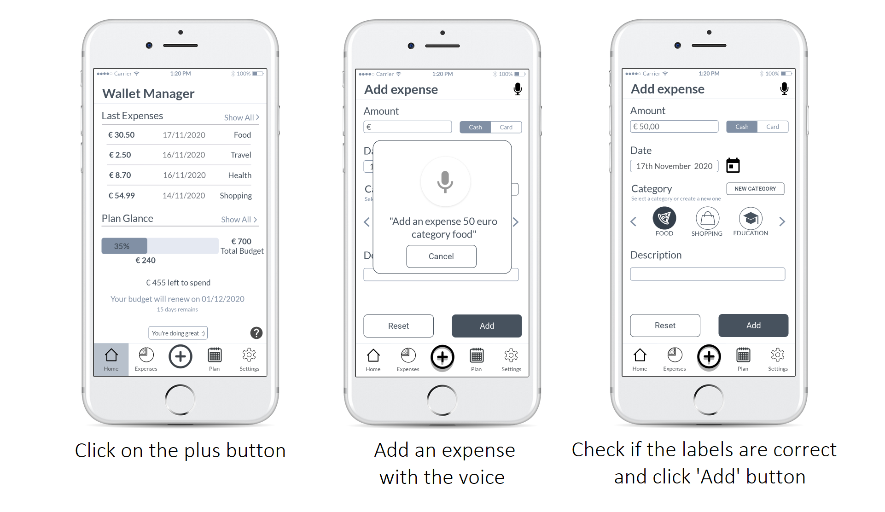

Figure 5: User flow to add an expense with the microphone.

 

### **Plan**

The "Plan" page allows the user to check his saving plan for a certain period. It shows how much money of the total budget he spent against the total budget planned with a progress bar.
He can see also the category budget which consists of a division of the total budget split into several categories (Figure 6).

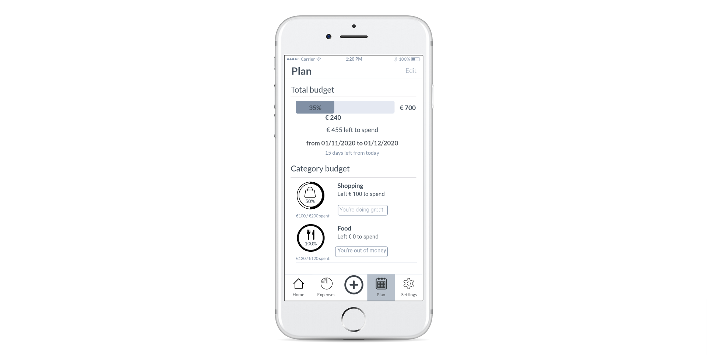

Figure 6: Plan page.

The user can change his Plan through the "Edit Plan" page reaching from the "Edit" button on the top-right of the "Plan" page (Figure 7). 

He can choose standard periods or a custom one, set a total budget, and set category budgets assigning them a part of the total budget (Figure 8).

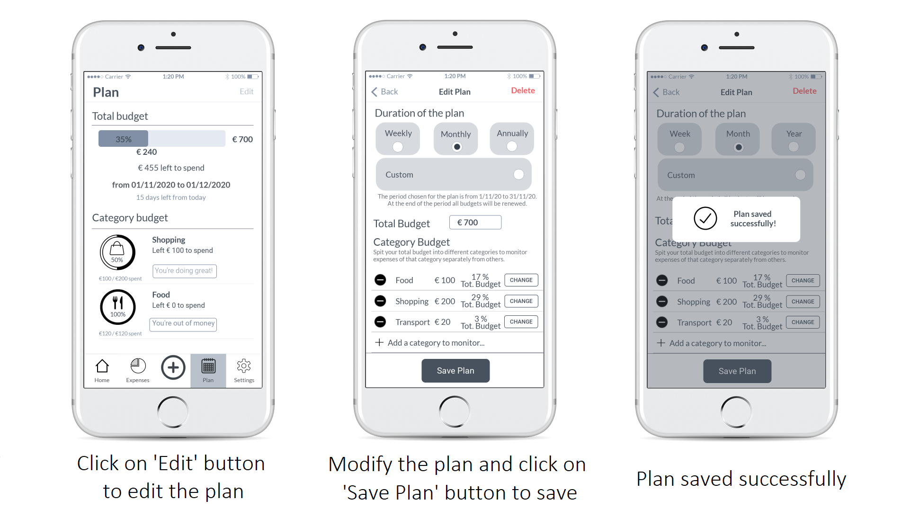

Figure 7: User flow to edit the saving plan.

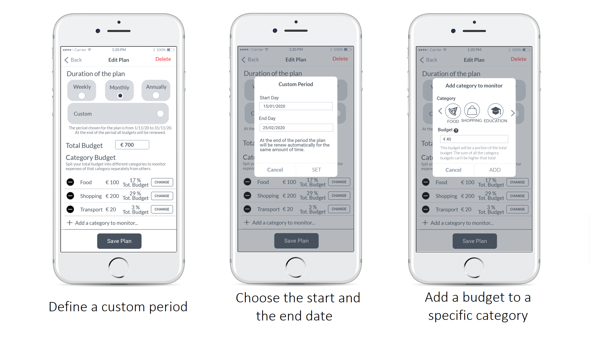

Figure 8: User flow to change period and category budget.

 

### **Settings + category list**

We also decided to implement a draft for the setting page reaching through the bottom bar. Inside this page, the user can see the list of existing categories and creates new ones. The "Add a category" page can be reached also from other pages like the "Add Expense" page by clicking on the "New category" button when the user selects the category for the new expense.

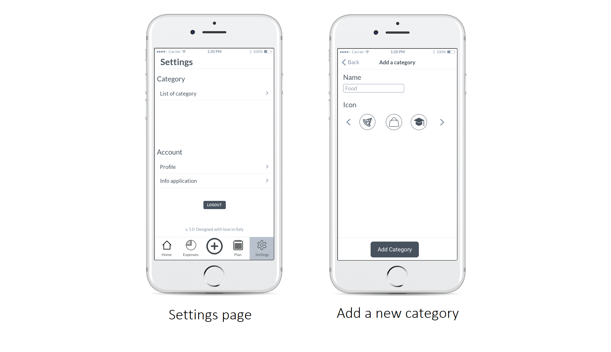

Figure 9: Setting and list with categories.

 
 

## Heuristic Evaluation

We received heuristic evaluations from two teams (*Clean Kitchen* and *Musician Matchmaking*).

We prepared an interactive prototype where they could browse freely through the app sections by clicking on icons like a real application (Prototype Link: https://marvelapp.com/prototype/26heihg6 ).

Also, we defined the main tasks that the evaluator should do and that cover the main functions of the prototype: 
- *Add an expense*: with this task, we cover the first user need "Need to add expenses in a simple and immediate way by dividing them into custom categories". For this reason we decided to evaluate the "Add expense" page because it allows the user to add an expense quickly with the help of the microphone.

- *Add/Edit a saving plan*: with this task, we cover the second user need "Define plans for future periods taking into account future expenses and help users to understand how much money is left to spend". For this reason we decided to evaluate the "Plan" page because it allows the user to create a budget for a certain period and certain categories.

- *See and edit the expenses*: we decided to define this task because is related to the two user needs; the users need to visualize the expenses and manage them to have a better understanding of their situation and implicitly define a better plan for a future period. For this reason we decided to evaluate the "Your Expenses" page because it allows users to see all the expenses and a pie chart that visualizes how much money they spent on different categories.

For each team, we show the two single evaluation and the joint one.

 

### **First evaluation**

**Team: Clean Kitchen**                                         

The facilitator and the observer did a video call with one evaluator at a time from the Clean Kitchen's team. 
The facilitator explained briefly the purpose of the application without going into details in order to have the minimum context necessary to evaluate. He decided to not explain the application page to page because he wanted to see if the evaluator could navigate and understand alone the functionality and the system status.
The evaluator shared the screen and started to navigate through the application (Figure 10).
During the navigation, the evaluator asked for more information and shared some feedback with us.
For example, one evaluator didn't understand the filtering mechanism and asked us for more information (Figure 11).

We reported the feedback from the first evaluator and the second evaluator in Table 1 and Table 2. The joint feedback is shown in Table 3.

| Issue# | Heuristic# | Description | Rating |
| --- | --- | --- | --- |
| 1 | H3 | In the "Your Expenses" page is not easy to go back after filtering the "Expense List". | 2
| 2 | H4 | In the "Add Expense" page there is a button called "Reset" that has the same position as the button "Cancel" on the other pages. | 2      
| 3 | H7 | The app might be easier to use if the user will be able to delete an expense quickly from the Homepage | 1   
| 4 | H10 | Lack of a tutorial is an important issue | 2                                

Table 1. First evaluator of Team Clean Kitchen.

 

| Issue# | Heuristic# | Description | Rating |
| --- | --- | --- | --- |
| 1 | H3 | The user can't go back when he clicks directly on a category label inside the pie chart. | 1                 
| 2 | H7 | The app might be easier to use if the user will be able to delete an expense quickly from the Homepage. | 1   
| 3 | H10 | The lack of a tutorial is an important issue. |2                     

Table 2. Second evaluator of Team Clean Kitchen.

 

| Issue# | Heuristic# | Description | Rating |
| --- | --- | --- | --- |
| 1 | H3 | In the "Your Expenses" page is not easy to go back after filtering the "Expense List".  | 1.5
| 2 | H4 | In the "Add Expense" page there is a button called "Reset" that has the same position as the button "Cancel" on the other pages. | 2      
| 3 | H7 | The app might be easier to use if the user will be able to delete an expense quickly from the Homepage. | 1   
| 4 | H10 | The lack of a tutorial is an important issue |2                             

Table 3. Joint feedbacks of Team Clean Kitchen.

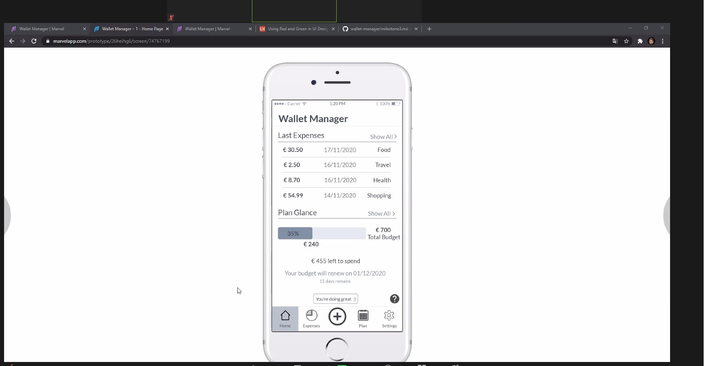

Figure 10: The evaluator shared the screen as he starts to navigate through the app.

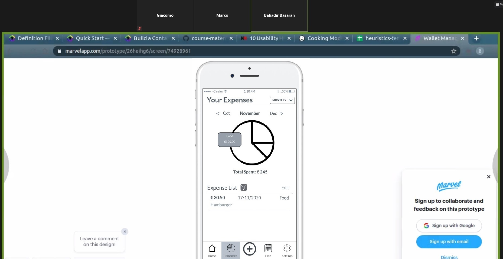

Figure 11: The evaluator doesn't understand the filter's icon and asks for more information.

 

### **Second evaluation**

**Team: Musician Matchmaking**

For the second evaluation, we used the same approach adopted for the first one making a video call with the evaluators (one at a time), explaining briefly the application, and observing the evaluator's activity (Figure 12 and 13). 

 

| Issue# | Heuristic# | Description | Rating |
| --- | --- | --- | --- |
| 1 | H1 | On the "Plan" page is not immediate to check the duration of a plan. You need to look at the text below the summary while an indication at the top may be clearer. | 3
| 2 | H1 | The user can be enticed to use the app by seeing larger textual feedbacks that summarize the trend of his/her expenses. The current feedback on the "Homepage" is as big as the help button, at the bottom of the interface. | 1                        
| 3 | H3 | The navigation of the application is made with the navbar at the bottom and back buttons appear in the submenus. Redundant back buttons in the main pages could help the user move through pages. | 2    
| 4 | H8 | The "Homepage" and "Your Expenses" pages have perhaps too similar functions. | 2                                       

Table 4. First evaluator of Team Musician Matchmaking.

 

| Issue# | Heuristic# | Description | Rating |
| --- | --- | --- | --- |
 | 1 | H1 | On the "Homepage" the feedback used to advise the user to save money sometimes is hard for them to understand. Use different colors in the bar which shows the budget is more intuitive. | 3   
| 2 | H1 | In the "Your Expenses" page is not clear if the icon filter is for editing or enabling the filter. | 3   
| 3 | H1 | On the "Homepage" is hard to check the balance by reading the text under the progress bar. Integrating it in the progress bar could be better. | 1       
| 4 | H2 | The page for editing a single expense is not the same as adding a new expense because is missing the microphone functionality. It's better to have the same page. | 2         
| 5 | H3 | The filter for Categories and Price should have an option and notation to enable or disable them.  | 3   
| 6 | H4 | The button to enable filter is confusing, better use "Done", "Confirm" or something like that to confirm users configurations. | 3    
| 7 | H7 | It's better to edit categories directly on some page rather than hide it in the expense creator.  | 1 
         
Table 5. Second evaluator of Team Musician Matchmaking.

 

| Issue# | Heuristic# | Description | Rating |
| --- | --- | --- | --- |
| 1 | H1 | On the "Homepage" the feedback used to advise the user to save money sometimes is hard for them to understand. Use different colors in the bar which shows the budget is more intuitive. | 3  
| 2 | H1 | In the "Your Expenses" page is not clear if the icon filter is for editing or enabling the filter. | 3          
| 3 | H1 | On the "Plan" page is not immediate to check the duration of a plan. You need to look at the text below the summary while an indication at the top may be clearer.  In the "Edit Plan" section the user can choose "Week", "Month", "Year" or "Custom" as the plan period. However, this information is not present on the "Plan" page. | 3
| 4 | H1 | The user can be enticed to use the app by seeing larger textual feedbacks that summarize the trend of his/her expenses. The current feedback on the "Homepage" is as big as the help button, at the bottom of the interface. | 1        
| 5 | H2 | The page for editing a single expense is not the same as adding a new expense because is missing the microphone functionality. It's better to have the same page. | 2
| 6 | H3 | The filter for Categories and Price should have an option and notation to enable or disable them.  | 3 
| 7 | H3 | The navigation of the application is made with the navbar at the bottom and back buttons appear in the submenus. Redundant back buttons in the main pages could help the user move through pages. | 2   
| 8 | H4 | The button to enable filter is confusing, better use "Done", "Confirm" or something like that to confirm users configurations. | 3  
| 9 | H7 | It's better to edit categories directly on some page rather than hide it in the expense creator.  | 1 
| 10 | H8 | The "Homepage" and "Your Expenses" pages have perhaps too similar functions. | 2     
                           
Table 6. Joint feedback of Team Musician Matchmaking.

 

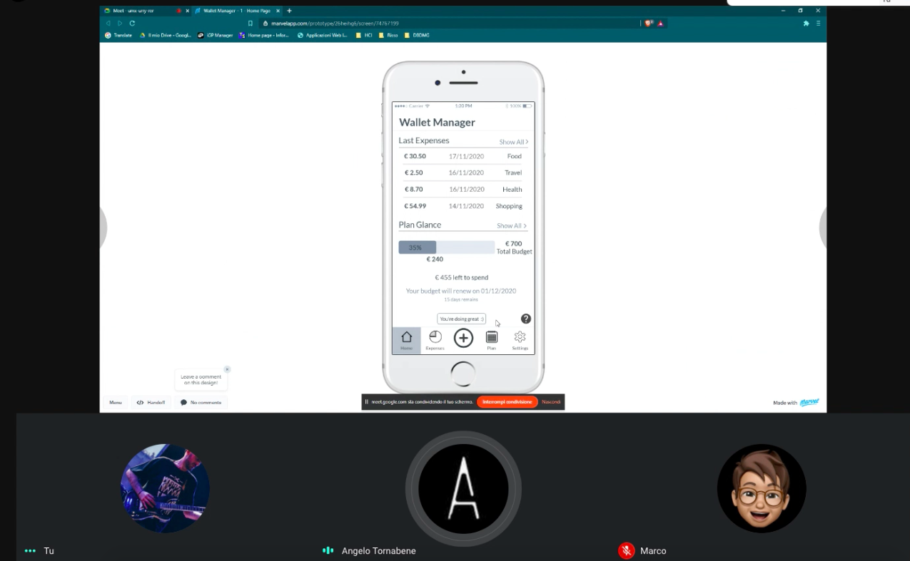

Figure 12: The first evaluator while notice Issue #1 (Table 6) regarding the visibility of the feedback.

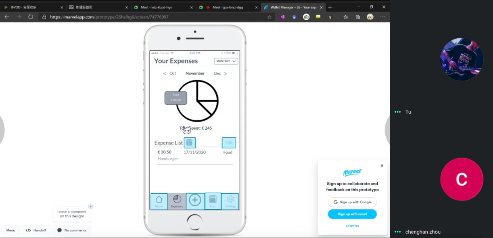

Figure 13: The second evaluator while having difficulties filtering expenses.

 

## Conclusion

After reading the feedback of the four evaluators by the two teams, we decided to change the following things:

- Many of the feedbacks received are related to the filters on the "Your Expenses" page. They are not intuitive and it is not immediate to remove them to return to the unfiltered list (Issue #1, Table 3; Issue #3, #5, #7 Table 6).

    To solve this problem we have decided to make the filter icon more visible, perhaps by adding a label, to move the "Edit" button of the Expenses List, to leave only the filter part, and to give the user the possibility to clean the filters through a specific button like "Clear All".

- Many feedbacks are about consistency and clearness of buttons like for adding a new expense or for the filter page (Issue #2, Table 3; Issue #8, Table 6).

    We decided to change the buttons labels as suggested by the evaluators in order to have a better understanding and consistency with other pages.

- In the "Edit Plan" section the user can choose "Week", "Month", "Year" or "Custom" as the plan period. However, this information is not clearly visible on the "Plan" page (Issue #4, Table 6).

    We have decided to add a label to show the option chosen by the user near the start and the end dates.

- On the "Homepage" the label that gives the user feedback of his situation ("You are doing great") is not so evident and it could be hard to understand  (Issue #1, Table 6).

    We decided to make the label bigger and move it under the "Total Budget" progress bar.

- We have decided to implement the possibility of removing an expense through gesture on the "Homepage". We have chosen to implement it only as a gesture (without an "Edit" button) to not fill the page with too much information (Issue #3, Table 3).

- We decided to make a tutorial for the functionality of the plan as the most complex. We also decided to improve the Help page with some documentation and provide the most common FAQ (Issue #4, Table 3).

