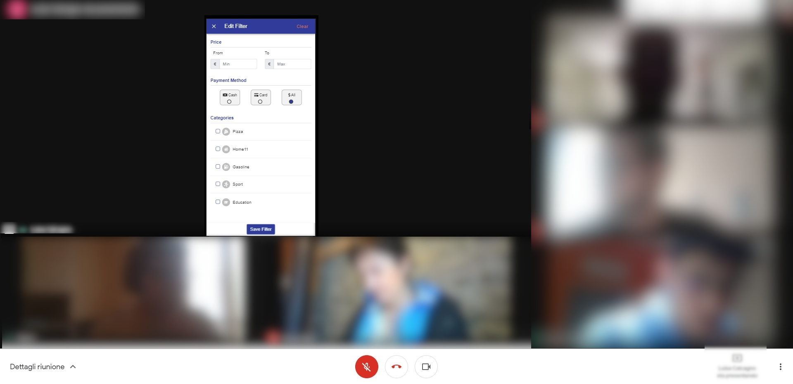
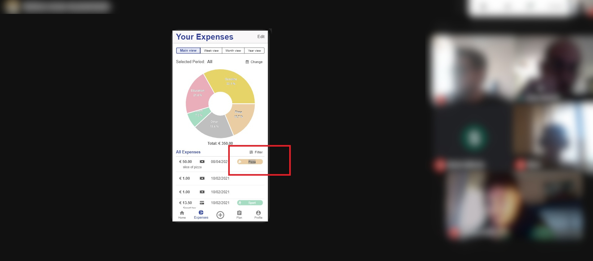
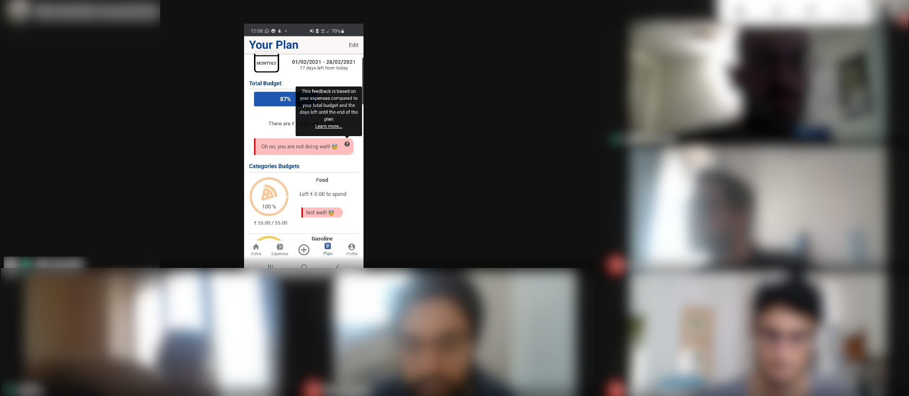
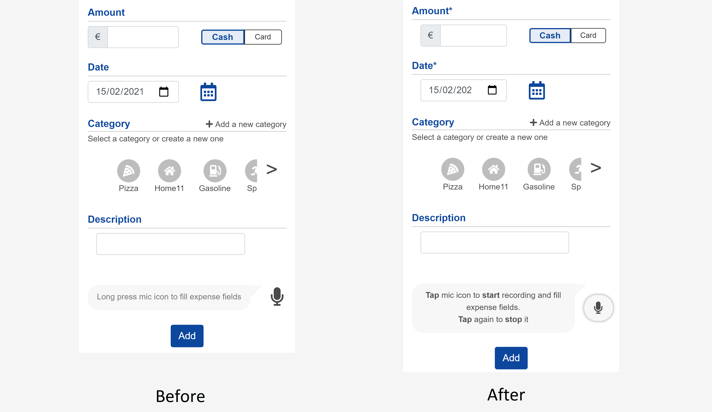
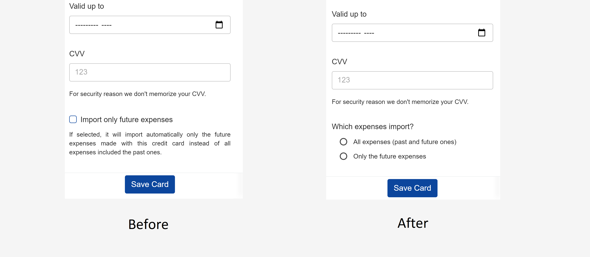
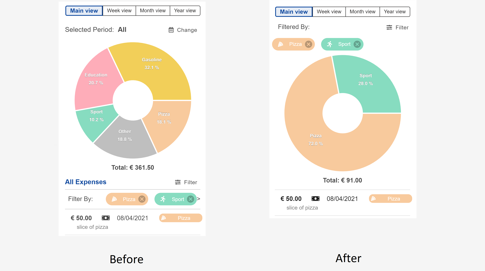
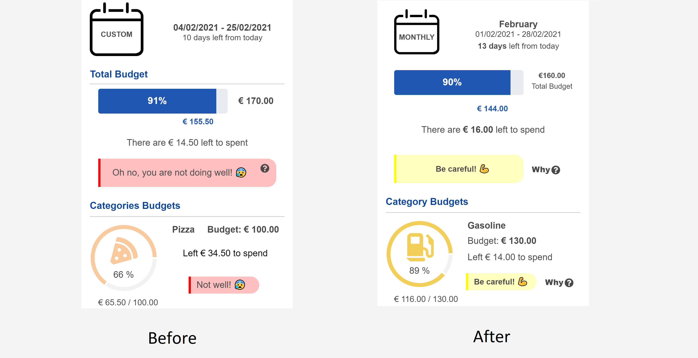

# Milestone 4: Usability Testing - Wallet Manager

## Overview and Script

We conducted the evaluations with three people, one for each category of people we have [delineated in M1](./../M1/milestone1.md) (beginner user, intermediate user and expert user).

We invited each person separately (one participant at the time) to join a Google Meet call. They shared the screen of the phone to let us see while trying the application and the webcam of the PC to see their reactions and behaviors during the execution of the task.

The facilitator read the prepared script ([Link to testing Protocol](./TestingProtocol.md)) explaining what the evaluation consists of and giving explicit consent for the video and the audio recording signing the informed consent form. After that, he read one task at the time and gave the user the time to execute that. 
The observers and the notetakers were on call with the video camera on but with the microphone off and they took notes during the evaluation.

For some tasks, it was decided to explicitly ask for feedback from the user after the execution of the task (subjective measure: "ease of use" and "likes, dislikes, and recommendations"). 

For **task 3** (*add an expense with the microphone*), it was decided to adopt the *cooperative methodology* as we expected difficulties because the users need to practice and learn specific commands to add an expense without errors. 

Moreover, we decided to use the *think-aloud methodology* for **task 5** (*filter the expense list*) and **task 9** (*explain the plan page*) as we wanted to be sure whether or not the user understood correctly the information on the page and its meaning.

At the end of the test, we provided a short questionnaire related to the complete experience they had with the application, and based on the answers we asked some follow-up questions.

## Results and List of Changes

### Results

| #Task | Metrics | User 1 | User 2 | User 3 |
| ----- | ------- | ------ | ------ | ------ |
|   1   | Successful Task Completion (0-100% based on the correctness of fields) | 100% | 100% | 100% |
|   1   | Time on task: 3 minutes | 0:45 | 1:10 | 1:30 |
|   2   | Successful Task Completion (0-100% based on the correctness of fields) | 100% | 100% | 90%   The user doesn't insert the icon |
|   2   | Time on task: 3 minutes  | 1:30 | 0:50 | 0:30 |
|   3   | Successful Task Completion (0-100% based on the correctness of fields) | 100% | 100% | 100% |
|   3   | Subjective measure: ease of use (1-5); 1 unusable to 5 easy | 3 | 4 | 2 |
|   3   | Subjective measure: Likes, dislikes and recommendations | Problem with the microphone activation | The user doesn't understand when the microphone was recording and when not | Problem with the microphone activation |
|   4   | Successful Task Completion (0-100% based on the correctness of fields)| 50 %   The user doesn't read the checkbox | 50 %   The user doesn't read the checkbox | 50 %   The user doesn't read the checkbox |
|   4   | Time on task: 3 minutes | 1:10 | 1:00 | 1:20 |
|   5   | Successful Task Completion (T/F) | T | T | T |
|   5   | Subjective measure: ease of use (1-5); 1 unusable to 5 easy | 3 | 3 | 3 |
|   6   | Successful Task Completion (T/F) | T   The user tried to click on the expense before finding the 'Edit' button | T   The user tried to click on the expense before finding the 'Edit' button | F   The user doesn't find the 'Edit' button |
|   6   | Time on task: 5 minutes. | 1:10 | 2:50 | failed |
|   7   | Successful Task Completion (T/F) | T | T | T |
|   7   | Subjective measure: ease of use (1-5);  1 unusable to 5 easy | 4 | 5 | 4 |
|   8   |Successful Task Completion (0-100% based on the correctness of fields) | 100% | 80% | 100% |
|   8   | Subjective measure: ease of use (1-5);  1 unusable to 5 easy | 4 | 3 | 4 |
|   9   | Successful Task Completion (T/F)| F   The user doesn't understand how the plan works | F   The user doesn't understand how the feedback and the plan work | F   The user doesn't understand that the plan is for the current month |
|   9   | Subjective measure: ease of use  (1-5);  1 unusable to 5 easy | 2 | 3 | 2 |

Table 1. Result of executing tasks

The analysis of the data collected during the evaluation allowed us to understand the main issues of our application based on users' feedback.

Even if **task 1** (*add an expense*) was passed according to the metrics by all the users involved, the observers noticed a general difficulty in finding the right page for the task (“Add Expense” page). 
The comparison with the users at the end of all the evaluation showed us that this difficulty was caused by a lack of consistency in the bottom bar of the menu: there is a label under the icon for each tab of the navbar except for the "Add Expense" page where we put only the "+" button.
This made users think that it wasn't part of the menu. 
The task was successful anyway because once the page was found all users completed the task without any difficulty, demonstrating good usability for the page.

**Task 2** (*add a category with an icon*) also had encouraging results. Only one user didn't complete the task at 100% because he failed to insert an icon even if explicitly requested by the task. 
We don't care about this problem because during the final discussion with the user it was found that due to anxiety he did the task hastily and forgot to add an icon.
This task, together with the previous one, was necessary to test the usability of the entire "Add Expenses" page, and given the results was considered pretty successful.

**Task 3** (*add an expense using the microphone*) was successfully passed by all users according to the metrics. However, questions and considerations posed by users during the cooperative methodology revealed evident usability problems.

First of all, users struggled to understand that the microphone icon was a button to press, requiring the intervention of the facilitator. Moreover, because it was required a long press to activate the microphone, users didn't understand if and when the recording of the microphone had started.

**Task 4** (*add a credit card importing the expenses' history*) was problematic because all the users completed it with only 50% accuracy according to the metrics. The problem was that all users checked the checkbox for import only the future expense while the task asks to import the past expenses too (the checkbox was supposed to remain unchecked).

Users have informed us that this behavior was caused by not reading the checkbox information because it was too long and not very visible. Furthermore, since the page containing the checkbox has sensitive information (credit card number and CVV), users believed that the checkbox referred to some legal information, therefore that it was necessary to checked to continue.

**Task 5** (*filter expenses*) was successfully passed by all the participants, but the average of their grades about usability was 3 (1-5 scale). Even if the users appreciated the possibility of having predefined views (week view, month view, and year view), everyone expected to be able to change the date also within the filters page. (Figure 1)

Figure 1: Users open the filter page to filter by date and they are lost because they don't find the option.

In **task 6** (*edit an expense*) all users have tried to modify the expense by clicking directly on the expense list and only after several minutes they find and press the "Edit" button that allows them to edit the expense. In one case, the task even failed because the user didn't find the button (Figure 2).

Figure 2: User selects the category label to edit them but this was not possible and as a result, he has selected the text inside.

**Tasks 7** (*delete two expenses*) and **task 8** (*add a plan*) were passed by all users without any relevant problems. In particular, in task 8 we noticed that the user was well guided in creating a new plan thanks to a few lines of tutorials present for each step. Thanks to this tutorial all users focused on reading and understanding the information and as a result, they rated the usability of the task as 5 (1-5 scale). This confirmed to us that the tutorial sentences were useful and not too long for users. 

In **task 9** (*understanding and editing the plan according to the feedback*) there were several problems for all users in understanding the feedback inside the "Plan" page.

Thanks to the *think-aloud methodology* we could figure out that users were able to understand the numerical information on the page (percentages, plan period, budgets), but not the information we wanted to convey thanks to the feedback (Figure 4).

Specifically, users couldn't understand why there was red feedback (negative) even though they didn't go over budget. Users pointed out that it wasn't clear that the feedback was based not only on the total spent but also on the remaining days at the end of the plan (Figure 3).

Figure 3: The user didn't understand why the feedback has a red color even if the budget was not exceeded yet (is at 87% only).

Generally, we understood that the prototype seems to be quite intuitive and easy to use. Thanks to the tests we had a confirmation of many known problems, like the low usability of adding an expense with the microphone, the filters page without the possibility to filter by date, and we also discovered new unexpected issues, like the difficulty of finding the edit button to edit the expense list.
In the end, we learned that we have to improve the clarity of some information especially in difficult parts like the "Plan" page that are necessary for the user to understand efficiently and immediately the status.

 

### List of changes

From the result obtained from **task 1** (*add an expense*), we understood that some users don't easily find the page to add new expenses. We think it is a consistency problem because the "+" button appears differently without a label with respect to other tabs.
For this reason, we have decided to make it more explicit by adding the label “Add Expense” under the icon.

From the result obtained from **task 3** (*add an expense using the microphone*), we understood that was not immediate how to use the microphone, and not every user recognized that the microphone icon is the button to activate it.
We first wanted to change the style of this icon making it more similar to a button.
Furthermore, we changed the text in its label making it more understandable and adding an example (Figure 4).
Finally, we also added sound feedback when the microphone is activated and when the user turns it off. 

Figure 4: "Add Expense" page before and after the implementantion considering the Usability Testing.

From the results obtained from **Task 4** (*add a credit card importing the expenses' history*), we understood that every user we tested clicked the checkbox without reading it. We think that it happened because the label was not clear and that it was very similar to the checkboxes for accepting the "*Terms and conditions*" (that is always accepted without reading them by people). 
For this reason, we have decided to make it more explicit by providing to the user two possibilities: "*All the expenses (past and future ones)*" and "*Only the future expenses*". 
We also decided to not select a default alternative in order to be sure that the user chooses the wanted alternative reading it (Figure 5).

Figure 5: "Add a Credit Card" modal before and after the implementantion considering the Usability Testing.

From the results obtained from **task 5** (*filter expenses*), we noticed that the user had problems when he didn't find the date filter on the "Edit Filter" page. 
For this reason, we have decided to include a date filter on that page. Since in the implementation before usability testing the pie chart doesn't change when users filter the expense list (filters are under the pie chart), it became difficult to include the date inside the filter without restructuring all the page (the date instead changes the pie chart). As a matter of fact, we have decided to move filters to the top of the pie chart and now all the filters change the pie chart too (Figure 6).

Figure 6: "Your expenses" page before and after the implementantion considering the Usability Testing.

From the results obtained from **task 6** (*edit an expense*), we noticed that the user did not easily identify the edit button and took too long to modify an expense. We also observed that all our users clicked directly on the expense in the list to modify it and consequently we implemented this additional functionality to modify an expense.

From the result obtained from **Task 9** (*understanding and editing the plan according to the feedback*), we understood that the feedback was misleading and not easily understandable.
The feedback implemented before usability testing takes into account the expenses the user made during the plan and projecting them at the end of the plan period. With this projection, we can understand if the user will run out of money before the end of the plan. 
For this reason, the feedback became red (negative feedback), before exceeding the total budget but this was not clear to the user during the usability testing.

Because of that, we decided that a negative message should appear only if the user exceeds the total budget and the medium feedback (yellow color) take its place when the expenses projection is over 100% (if the user will keep spending in this way, he will run out of money before the end of the plan).
Finally, the positive feedback will be shown in all other cases (when the user has not exceeded the budget and his projection will be less than 100%) (Figure 7).

Moreover, all feedbacks have a visible "Why?" button near to them. If the user presses the button, it opens the explanation of the feedback with a "Learn more..." link that allows users to access the "Help" page where they will find the documentation and more information.

Figure 7: "Plan" page before and after the implementantion considering the Usability Testing.
